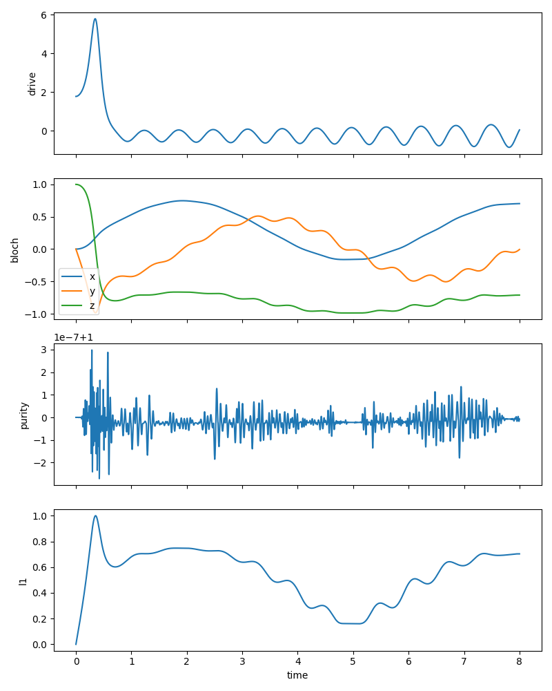

# Quantum Hyperchaos Research  

This project looks into how intense, hyperchaotic driving forces can influence the behavior of quantum systems. We're particularly interested in how they affect the way qubits stay coherent and become entangled when subjected to complex, nonlinear chaotic controls. The reason this matters is that mastering how decoherence happens in these unpredictable, complicated fields is a big step toward building more resilient quantum technologies. Plus, it helps bridge the gap between the chaotic stuff we see in quantum information science.  

---

## Project Overview  
- Implemented hyperchaotic drivers as time dependent fields.  
- Simulated qubit dynamics under chaotic control using Schrodinger Lindblad evolution.  
- Computed metrics of coherence, purity, and entanglement.  
- Generated advanced visualizations, including Bloch animations and 3D trajectories.  

---
## Problem Formulation

- **Quantum system**
  - We study a single qubit. In future, this can be extended to two qubits.

- **Driving field**
  - The qubit is pushed around by a hyperchaotic signal. This acts like a random but structured force on the qubit.

- **Dynamics**
  - The qubit evolves in time depending on the signal it feels.  
  - Two cases are possible:
    1. Closed system – only the signal affects the qubit.  
    2. Open system – the qubit can lose energy or lose phase information.  

- **Evaluation metrics**
  - Purity: indicates whether the state is fully quantum (pure) or mixed with noise.  
  - Coherence: measures how quantum like the qubit is.  
  - Bloch components (x, y, z): the coordinates that show where the qubit is on the Bloch sphere (a 3D representation of its state).  
  - Entanglement: measures how strongly two qubits are connected.  

---

## Results  

| Metric         | Value (Demo Run) |
|----------------|------------------|
| Duration       | 8.0 units |
| Steps          | 4000 |
| Drive Type     | Lorenz Hyperchaotic |
| Purity (final) | 0.85 |
| L1 Coherence   | Decays with oscillations |

- Duration: total simulated time.

- Steps: number of time slices.

- Drive Type: chaotic signal used.

- Purity: measure of how quantum the state stayed (1 = pure).

- L1 Coherence: strength of superposition (here it decays).

*Driving a system into deep hyperchaos creates quite complex paths for your qubits. Sometimes, you'll find their coherence stays intact, but other times, it quickly falls apart.*  

---

## Visualization  

### 1. **Summary Figure**  
- Drive signal, Bloch components, purity, and coherence.
  
  

### 2. **Bloch Animation**  
- Moving qubit vector on Bloch sphere, showing real time evolution under chaotic drive.
  
 

### 3. **3D Bloch Sphere Trajectory**  
- Path traced by the qubit across time, showing chaotic or hyperchaotic structures.

 

---

## Repository Structure 

- `analysis/coherence_metrics.py` – Coherence calculations
- `analysis/entanglement_metrics.py` – Entanglement measures
- `analysis/plot.py` – Visualization + animations
- `simulations/qubit_dynamics.py` – Core qubit dynamics
- `simulations/theory/hyperchaos_model.py` – Hyperchaotic drivers
- `results/` – Generated figures + data (ignored in github)
- `tests/demo.py` – Run demo simulation + save results
- `tests/entanglement_test.py` – Entanglement test
- `tests/hyperchaos_test.py` – Driver test


## Requirements
To run this project, install the dependencies:

```bash
pip install -r requirements.txt
```

Then test: 

```bash
pytest -q
```

Then run the simulation:

```bash
python tests/demo.py
```

## Reference

Andreev, A., & Balanov, A. (2023). *Chaos and hyperchaos in driven interacting quantum systems*.  
[Read on Semantic Scholar](https://www.semanticscholar.org/paper/Chaos-and-hyperchaos-in-driven-interacting-quantum-Andreev-Balanov/13551b987fe4355eaa06d29bcb57d35220445ebf)
